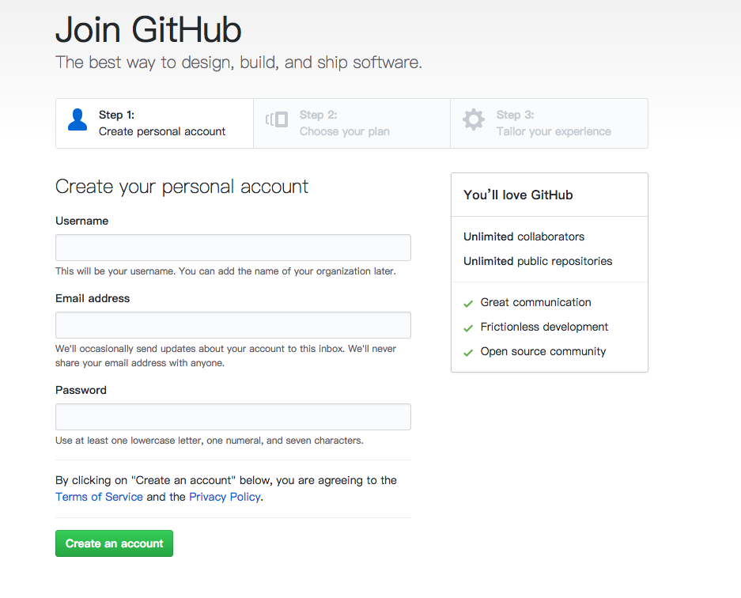
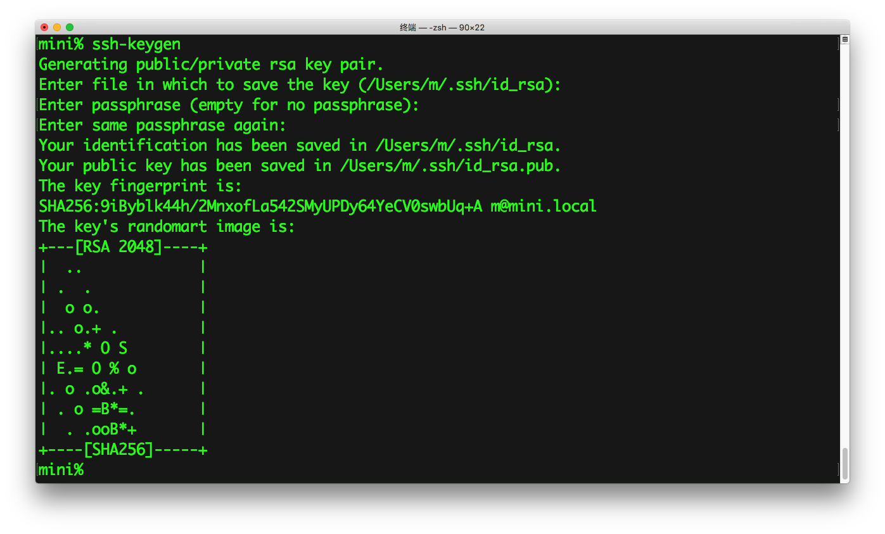
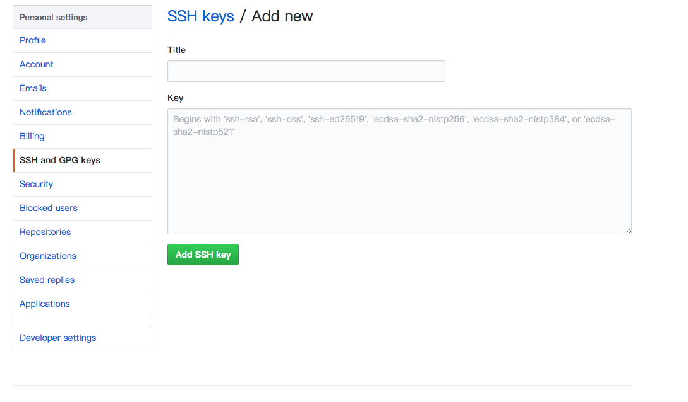

github 快速入门 
===


### 账号注册
首先你需要[注册](https://github.com/join)一个 github 账，如图所示，设置账号密码和邮箱，其它都可以使用默认设置。


### 安装 git 

安装 homebrew 
```
$ /usr/bin/ruby -e "$(curl -fsSL https://raw.githubusercontent.com/Homebrew/install/master/install)"
```
安装 git
```
$ brew install git
```
### 配置 git
配置一下全局用户名和全局邮箱
```
$ git config --global user.name "halo"  
$ git config --global user.email "haloislet@gmail.com"
```
```
$ git config --global --list # 查看全局配置
```

### 配置 ssh
git 连接 github 的时候会用到 ssh 。我们需要配置一下 ssh。

使用 ssh-keygen 命令来生成私钥和公钥。
```
$ ssh-keygen
```

将公钥配置到 github 的 [SSH keys](https://github.com/settings/ssh/new) 中

```
$ cat ~/.ssh/id_rsa.pub 
```
将输入的内容复制到 Key 中,Title 可以自定义一个名字。


附：ssh-keygen 有两个常用的参数 -t 和 -C ，其中 -t 参数用来指定加密的算法默认值为 rsa 。-C 参数为注释,默认为当前用户名@本地主机名。

### 创建 github 新仓库
在[创建仓库页面中](https://github.com/new)输入自定义的仓库名然后点击 Create repository 就可以了。

### 创建本地仓库并上传到 github 仓库
```
$ git init # 创建本地仓库
$ touch README.md # 创建 README 文件
$ git add . # 将文件添加到暂存区,暂存区中保存的是将要提交的文件
$ git commit -m "first commit" # 提交暂存区的文件变化到本地仓库
$ git remote add origin git@github.com:haloislet/github-quick-start.git # 添加一个远程仓库并将名字标记为 origin
$ git push origin master # 将本地仓库的内容提交到名为 origin 的远程仓库的 master 分支
```

### 下载 github 仓库
```
$ git clone git@github.com:haloislet/github-quick-start.git
```

### 拉取远程更新
```
$ git pull origin master
```
